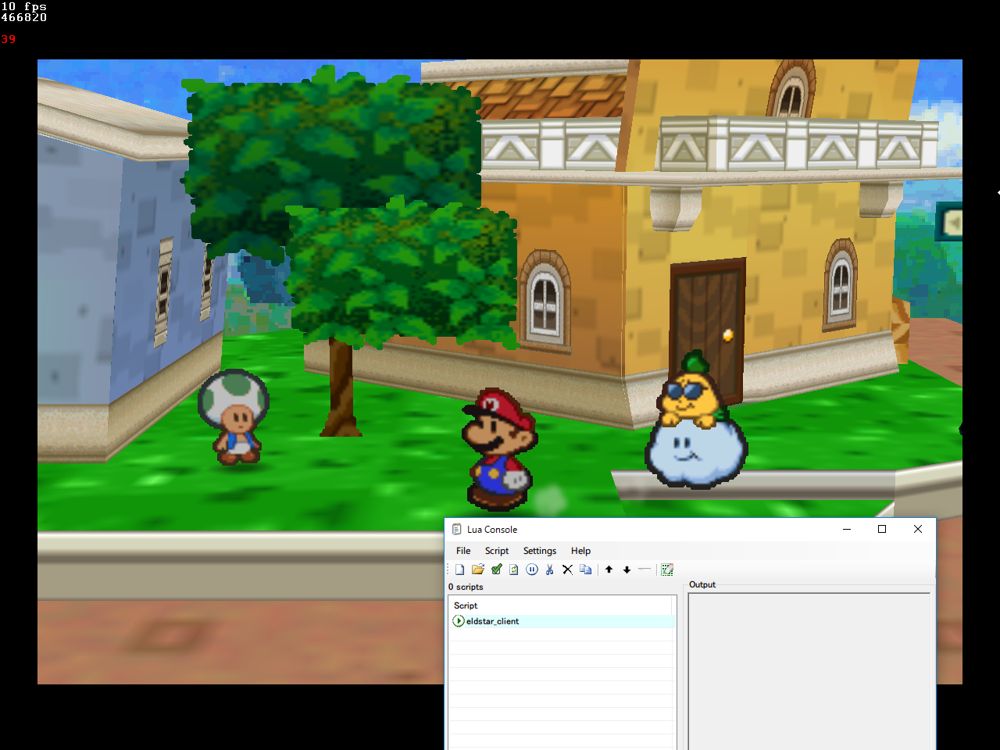

# eldstar

Paper Mario realtime collision observer and dumper.

This consists of two parts:

## The Server

The server is written in C++ and processes and renders the data from the client. It is written using OpenGL via GLFW, and can be built with CMake.

## The Client

The currently available client is written in Lua for the BizHawk emulator.
It serializes data from the emulator core RDRAM and sends it via socket to the server.

The server is client-agnostic and it is possible to write a client for other emulators if the same data can be obtained through their APIs.

